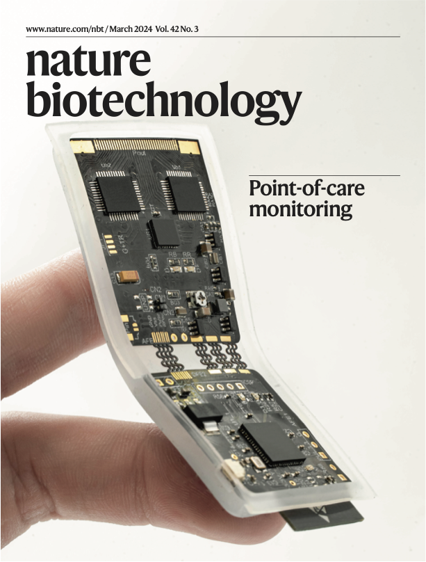

Recent advances in wearable ultrasound technologies have demonstrated the potential for hands-free data acquisition, but technical barriers remain as these probes require wire connections, can lose track of moving targets and create data-interpretation challenges. Here we report a fully integrated autonomous wearable ultrasonic-system-on-patch (USoP). A miniaturized flexible control circuit is designed to interface with an ultrasound transducer array for signal pre-conditioning and wireless data communication. Machine learning is used to track moving tissue targets and assist the data interpretation. We demonstrate that the USoP allows continuous tracking of physiological signals from tissues as deep as 164 mm. On mobile subjects, the USoP can continuously monitor physiological signals, including central blood pressure, heart rate and cardiac output, for as long as 12 h. This result enables continuous autonomous surveillance of deep tissue signals toward the internet-of-medical-things.

