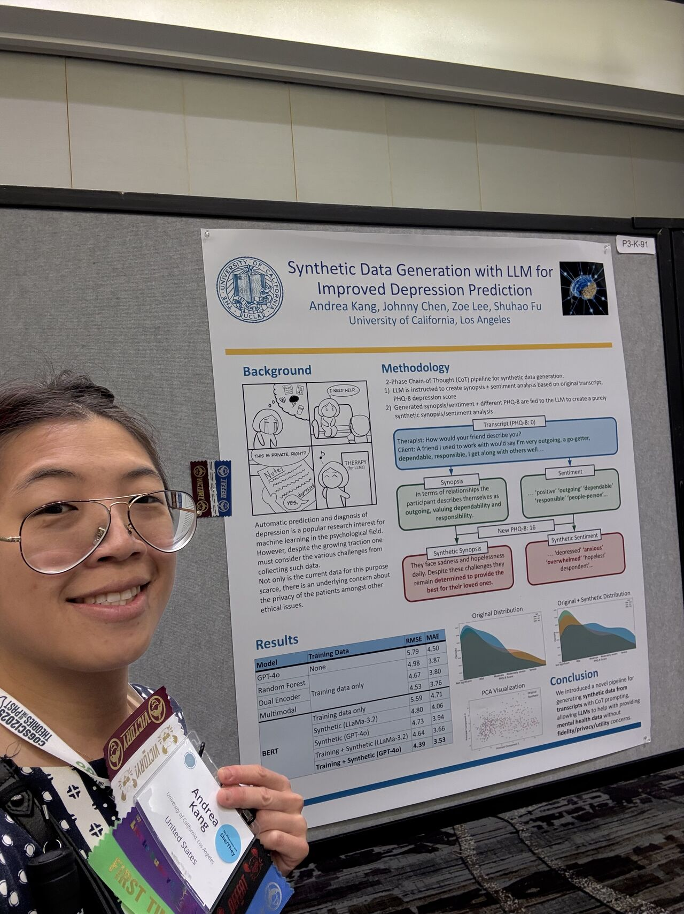

Automatic detection of depression is a rapidly growing field of research at the intersection of psychology and machine learning. However, with its exponential interest comes a growing concern for data privacy and scarcity due to the sensitivity of such a topic. In this paper, we propose a pipeline for Large Language Models (LLMs) to generate synthetic data to improve the performance of depression prediction models. Starting from unstructured, naturalistic text data from recorded transcripts of clinical interviews, we utilize an open-source LLM to generate synthetic data through chain-of-thought prompting. This pipeline involves two key steps: the first step is the generation of the synopsis and sentiment analysis based on the original transcript and depression score, while the second is the generation of the synthetic synopsis/sentiment analysis based on the summaries generated in the first step and a new depression score. Not only was the synthetic data satisfactory in terms of fidelity and privacy-preserving metrics, it also balanced the distribution of severity in the training dataset, thereby significantly enhancing the model's capability in predicting the intensity of the patient's depression. By leveraging LLMs to generate synthetic data that can be augmented to limited and imbalanced real-world datasets, we demonstrate a novel approach to addressing data scarcity and privacy concerns commonly faced in automatic depression detection, all while maintaining the statistical integrity of the original dataset. This approach offers a robust framework for future mental health research and applications.

